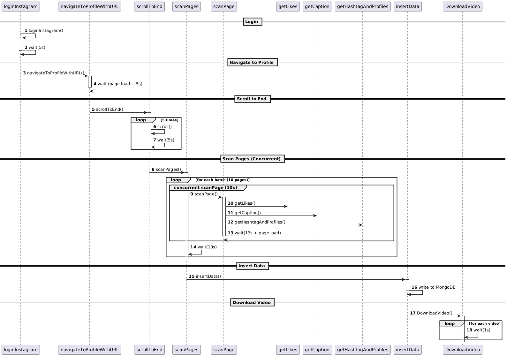

# Flow




<details>
<summary>uml code</summary>

```
@startuml
autonumber

participant "loginInstagram" as LI
participant "navigateToProfileWithURL" as NP
participant "scrollToEnd" as SE
participant "scanPages" as SP
participant "scanPage" as PG
participant "getLikes" as GL
participant "getCaption" as GC
participant "getHashtagAndProfiles" as GH
participant "insertData" as ID
participant "DownloadVideo" as DV

== Login ==
LI -> LI : loginInstagram()
activate LI
LI -> LI : wait(5s)
deactivate LI

== Navigate to Profile ==
LI -> NP : navigateToProfileWithURL()
activate NP
NP -> NP : wait (page load + 5s)
deactivate NP

== Scroll to End ==
NP -> SE : scrollToEnd()
activate SE
loop 5 times
    SE -> SE : scroll()
    SE -> SE : wait(5s)
end
deactivate SE

== Scan Pages (Concurrent) ==
SE -> SP : scanPages()
activate SP
loop for each batch (10 pages)
    group concurrent scanPage (10x)
        SP -> PG : scanPage()
        activate PG
            PG -> GL : getLikes()
            PG -> GC : getCaption()
            PG -> GH : getHashtagAndProfiles()
            PG -> PG : wait(13s + page load)
        deactivate PG
    end
    SP -> SP : wait(10s)
end
deactivate SP

== Insert Data ==
SP -> ID : insertData()
activate ID
ID -> ID : write to MongoDB
deactivate ID

== Download Video ==
ID -> DV : DownloadVideo()
activate DV
loop for each video
    DV -> DV : wait(1s)
end
deactivate DV

@enduml

```

</details>
